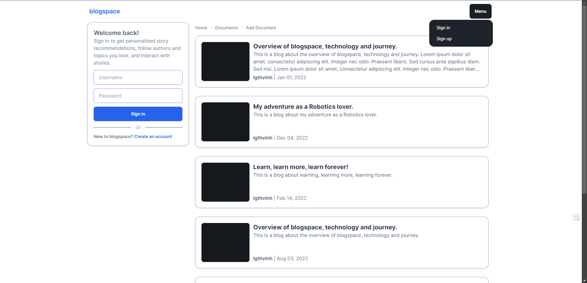
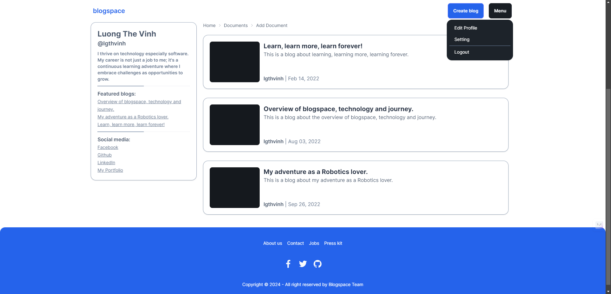
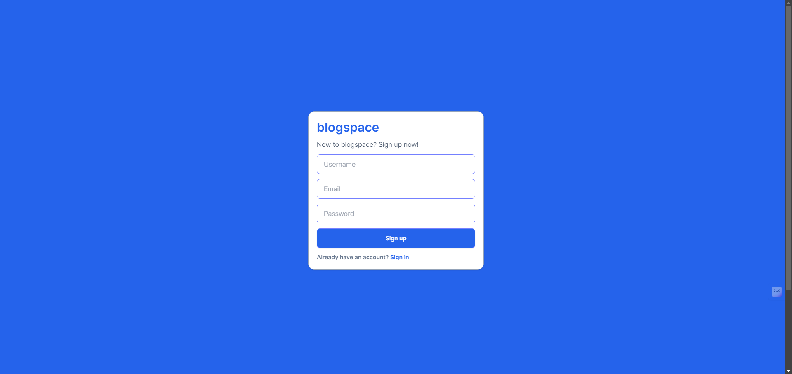
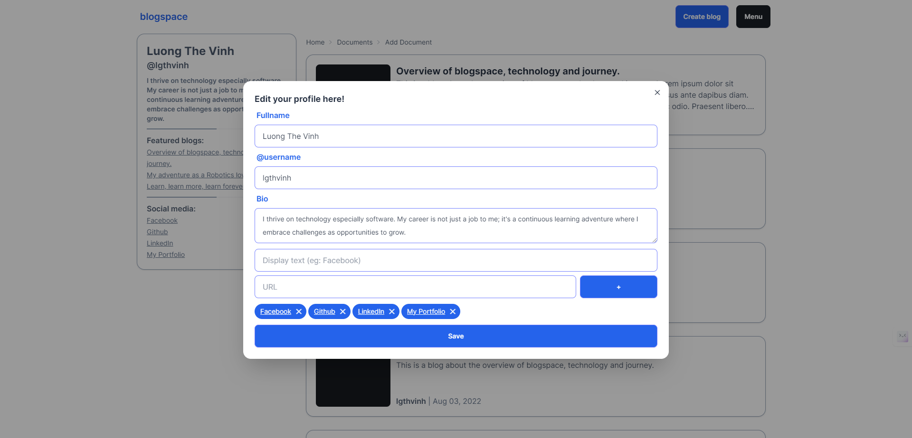
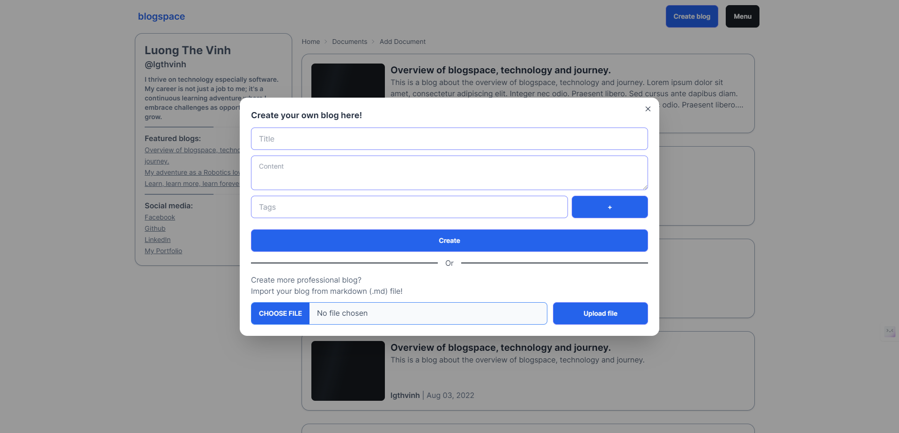
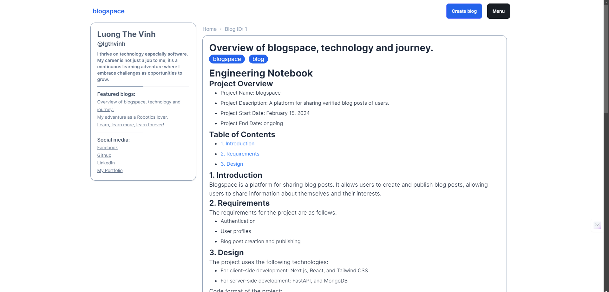

Blogspace is a platform for sharing blog posts. It allows users to create and publish blog posts after getting verified, allowing users to share information about themselves and their interests.

## Overview

Blogspace is a project that aims to create an "open" blog platform for everyone can read and write blog posts, but with a little bit of control. Currently, the platform is in the early stages of development, and we are looking for contributors to help us build and improve the platform. 

## Key Features

- **User Authentication** and **Authorization**
- **User Profile** for users to share information about themselves
- **Blog Post Verification System** with AI assisted
- **Markdown Editor** for writing blog posts

These are just a few of the key features that we are planning to implement in the platform. We are open to suggestions and contributions from the community to help us improve the platform.

## Some sneak peek

Home page

After login

Sign up page

Edit profile page

Create blog post

Blog page

## How to Contribute

If you are interested in contributing to Blogspace, please visit our GitHub repository and read the documents. You can also reach out to us via email or social media if you have any questions or suggestions. We would love to hear from you and work together to make Blogspace a great platform for sharing blog posts.

## Our links

- [GitHub Repository](https://github.com/lgthevinh/blogspace/tree/main)
- [Email](mailto: everwellmax@gmail.com)