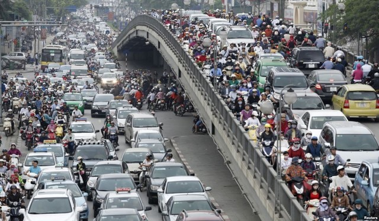
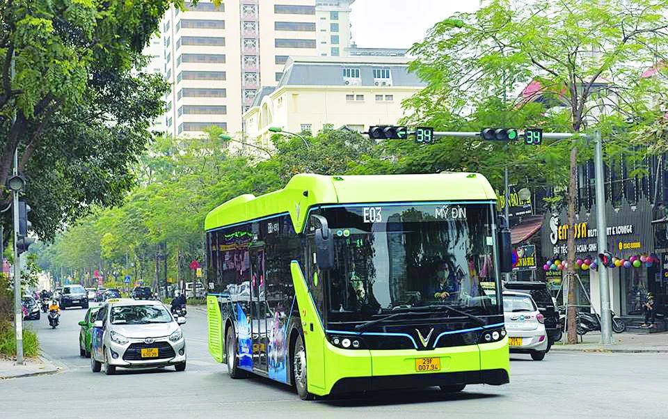
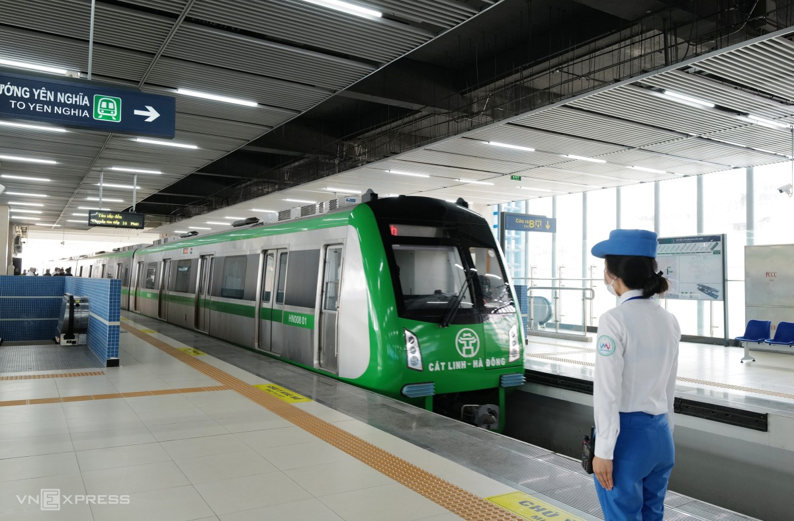

# How Internet would help to adapt in Hanoi

Hanoi is an interesting city with very complex culture and history. This place is also a head city of universities, so each year witness thougsands of students come to study and live here. Therefore, I want to write this to help freshers have a better experience when they come to Hanoi. In this article, I will only show you how I manage to use Internet to adapt in Hanoi.

In this blog, I will cover the following topics:
- **Transportation**: How to move around the city - most important thing!
- **Accommodation**: Where to stay and how to find a good place to live
- **Food**: What to eat and where to eat
- **Entertainment**: What to do in your free time

## Transportation

Hanoi is enormous and has a lot of traffic. The best best way to move around the city is by motorbike. If you can't ride a motorbike or don't have one. It's better to use public transportation like buses and metros because it's very cheap. At last option, you can use Grab to move around the city, but I don't recommend it because it's quite expensive if you move rappidy and frequently.

For bike riders, there are some key points to consider:
- **Traffic rules**: Traffic in Hanoi is very chaotic, so you need to be very careful when riding a bike. Always wear a helmet and follow the traffic rules.
- **Navigation**: Google Maps is the best tool to navigate around the city. It's better to navigate the destination and route before you go. Internet connection or offine maps are crucial when you move with motorbike.
- **Traffic jams**: Traffic jams are very common in Hanoi, especially during rush hours. It's better to avoid moving around the city during these hours. Use Googles Maps to check the traffic status before you go. The longer you live in Hanoi, the more you will know the traffic status in each area. Rainy days are also the worst time to move around the city as the traffic is very heavy.

For public transportation, some considerations are:
- **Routes**: There are many bus routes in Hanoi, so it's better to check the route and schedule before you go. Some apps like Google Maps or BusMap Hanoi are very very helpful to find routes and schedules.
- **Payment**: You can pay for the bus ticket by cash or by bus card. It's better to use a bus card because it's cheaper and more convenient. You can buy a bus card at the bus station or some convenience stores. Some bus do not accept banking (except VinBus), it's better prepared some cash in your pocket, and it's should be small money.
- **Safety**: Public transportation in Hanoi is quite safe, but you need to be careful with your belongings. Always keep an eye on your belongings and don't leave them unattended.
- **Metro**: The metro system in Hanoi is still under construction, there are only 2 lines available. It's better to use the metro if you want to move around the city quickly and avoid traffic jams. The metro is quite safe and convenient.

For Grab or other ride-hailing services, few things to consider:
- **Price**: Grab is quite expensive in Hanoi, so it's better to use it only when you have no other choice. If you use it frequently, it will cost you a lot of money.
- **Safety**: Grab is quite safe in Hanoi, but you need to be careful with the driver. Always check the driver's information before you go and share your trip with your friends or family. It's always better to get service through the app, not some random driver on the street because it's could be cheaper and able to track your trip through the app.

In conclusion, moving around the city is quite challenging, but if you make use of the Internet, services and apps, it will be much easier and more convenient. Always be careful and do some research before you go.

## Accommodation

Finding a good place to stay in Hanoi is quite challenging, especially for freshers. There are many options available, and some people might say that it's better to stay close to your university or workplace. But it's not always worth it because the rent is quite expensive in these areas, and the quality of the room is not always good if I don't say it's bad...

Here are some tips to find a good place to stay in Hanoi:
- **Location**: Base on how you can travel around the city. If you have a motorbike, it's better to stay in the suburbs because the rent is cheaper and the quality of the room is better. If you don't have a motorbike, it's better to stay close to the bus station or metro station. My experience is never stay close to the university or workplace because it's not worth it.
- **Price**: Renting in Hanoi is expensive, it's better to find a roommate or do intensive research to find best rent. Facebook groups and Zalo groups are helpful, and you shoud see the room in person before making decisions. Best is for senior students to help you find a good place to stay.
- **Quality**: The quality of the room is very important, especially the bed, the bathroom, and the kitchen. It's better to check the room in person before you make a decision. Some rooms are very small and dirty, so be careful when choosing a place to stay.

Internet play a crucial role in finding a place to stay in Hanoi. You can use some apps like Facebook or Zalo to find a place to stay. Always be careful and do some research before you make a decision.

## Food

Hanoi is famous for its street food, and there are many options available for you to choose from. Some of the most popular dishes in Hanoi include pho, bun cha, banh mi, and egg coffee. These dishes are very delicious and affordable, so you should definitely try them when you come to Hanoi.

Finding places to eat in Hanoi is quite easy with the help of Internet. Do some research, read or watch reviews, and ask for recommendations from seniors. Then you can enjoy the beauty of Hanoi cuisine.

Some of my favorite meals:
- **Pho**: Hanoi classic dish, you can find it everywhere in the city. It's very delicious and affordable.
- **Bun cha**: Another classic dish in Hanoi, it's very delicious and affordable. But my local friends said it better to eat in lunch time because it's would be "smelly" your cloths if eat in the evening.
- **Banh mi**: Hanoi street food, best for breakfast and affordable.
- **Bun rieu**: Favorite hommie dish, to eat in the mid night.